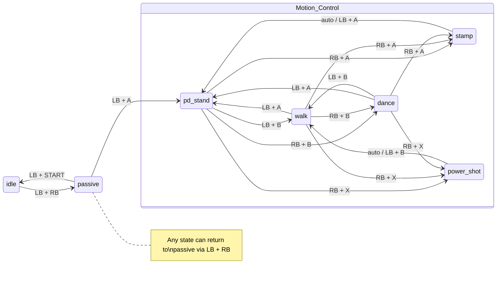

# EngineAI Robotics Native SDK Fork

This repository is a fork of the official
[engineai-robotics/engineai_robotics_native_sdk](https://github.com/engineai-robotics/engineai_robotics_native_sdk).

It keeps the original EngineAI Native SDK architecture and toolchain, while adding practical fixes and workflow improvements for local development, deployment, controller operation, and motion extension.

If you find a problem or have an improvement, pull requests are welcome.

## What This Fork Adds

- **Deployment fixes:** fixes and adjustments for issues encountered when deploying and running the SDK in real development environments.
- **macOS gamepad support:** physical gamepads connected to macOS can be bridged into the Docker-based SDK runtime, including HID backend support for controllers such as DUALSHOCK 4.
- **Simpler motion extension:** whole-body RL tracking motions can be added through configuration and policy files, without copying runner code or creating new per-motion C++ classes when the shared tracking interface is sufficient.
- **Improved simulation workflow on macOS:** MuJoCo can be run in Docker with browser-based VNC viewing for systems where native container GUI display is unavailable.

For the original upstream project, documentation, and baseline implementation, see:

- Upstream repository: <https://github.com/engineai-robotics/engineai_robotics_native_sdk>
- EngineAI Native SDK documentation: <https://dx3a2bminsq.feishu.cn/wiki/KyD9wDc4mi03uXkTVuAc5LQan4C>

## Overview

The EngineAI Native SDK is a C++20 humanoid robot control framework for application development, simulation verification, and real-robot deployment. It provides a modular runtime, runner-based motion control plugins, robot-specific configuration files, model and parameter management, MuJoCo simulation support, and deployment scripts.

The major modules are:

- **Runtime executor:** starts the control framework and manages task execution.
- **Runner plugins:** implement motion/control behaviors and load policies or parameters.
- **Hardware drivers:** connect the runtime to robot hardware interfaces.
- **ROS2 bridge nodes:** expose selected SDK data and control interfaces to ROS2.
- **Protocol definitions:** define messages and services used by the system.
- **Robot assets:** store robot configs, policy paths, models, and resources.
- **Simulation tools:** build and run the MuJoCo simulation environment.
- **Virtual gamepad tools:** provide GUI, keyboard, and physical-controller input paths.

## Repository Layout

```text
native_sdk/
├── assets/
│   ├── config/              # Robot-specific runtime configuration
│   └── resource/            # Robot models and resources
├── core/                    # Core framework libraries
├── docker/                  # Docker development environment
├── docs/                    # README images and supporting docs
├── scripts/                 # Build, simulation, and runtime helpers
├── simulation/mujoco/       # MuJoCo simulation code
├── src/
│   ├── executor/            # Runtime entry and executor logic
│   ├── runner/              # Motion/control runner plugins
│   ├── hardware/            # Hardware drivers
│   ├── ros2_node/           # ROS2 bridge nodes
│   ├── protocol/            # Interface protocol definitions
│   └── data/                # Data and parameter modules
├── tools/virtual_gamepad/   # Virtual and physical gamepad bridge
├── build.sh                 # Main SDK build script
├── run.sh                   # Local runtime launcher
└── install.sh               # Real-robot deployment script
```

Generated build output belongs in `build/`.

## Quick Start

All compile, test, and runtime commands should be executed inside the Docker development environment.

### 1. Install Docker

Install Docker and Docker Compose:

```bash
curl -fsSL https://get.docker.com -o get-docker.sh
sudo sh get-docker.sh
```

Users in China may use a mirror:

```bash
export DOWNLOAD_URL="https://mirrors.tuna.tsinghua.edu.cn/docker-ce"
curl -fsSL https://get.docker.com -o get-docker.sh
sudo sh get-docker.sh
```

Allow running Docker without `sudo`:

```bash
sudo usermod -aG docker $USER
```

Log out and log back in, or reboot, for the Docker group change to take effect.

Verify the installation:

```bash
docker --version
docker compose version
```

### 2. Generate the Development Container

```bash
cd native_sdk
./docker/generate.sh
```

The script creates a container and mounts this repository into it. It also creates the `engineai_robotics_env` shortcut.


Open a new terminal and enter the container:

```bash
engineai_robotics_env
```


### 3. Build

```bash
engineai_robotics_env
./build.sh
```

Build with GoogleTest targets enabled:

```bash
./build.sh -t debug -T
```

Rebuild one runner after a full build:

```bash
./build.sh -m rl_walking_example
```

### 4. Run

```bash
engineai_robotics_env

# Run with the default robot model
./run.sh

# Run with a specific robot model
./run.sh pm01_edu
```

After startup, the runtime enters `idle` by default.

## Testing

Tests are built only when `BUILD_TESTS` is enabled, normally through `./build.sh -T`.

```bash
engineai_robotics_env
./build.sh -t debug -T
ctest --test-dir build --output-on-failure
```

Avoid tests that require live robot hardware unless the hardware requirements and operator assumptions are clearly documented.

## Controller Operation

The SDK switches robot motion states through a finite state machine. Each state declares explicit entry conditions and allowed transitions so that unsafe transitions are rejected.

### Logitech F710

Use a Logitech Wireless Gamepad F710 in Xbox mode. After the USB receiver is connected, the controller should be recognized automatically in the container environment.

### macOS Physical Gamepad Bridge

This fork supports using physical controllers connected to macOS and forwarding their input into the Docker runtime through the virtual gamepad tool.

List connected gamepads:

```bash
python3 tools/virtual_gamepad/virtual_gamepad.py --list-gamepads
```

Run the bridge without GUI:

```bash
python3 tools/virtual_gamepad/virtual_gamepad.py --no-gui \
  --lcm-url 'udpm://239.255.76.67:7667?ttl=1'
```

For Bluetooth DUALSHOCK 4 or other controllers not recognized correctly by pygame/SDL, use the HID backend:

```bash
python3 tools/virtual_gamepad/virtual_gamepad.py --no-gui --backend hid \
  --lcm-url 'udpm://239.255.76.67:7667?ttl=1'
```

If Docker Desktop blocks host-to-container multicast or UDP traffic, use the docker-exec relay:

```bash
python3 tools/virtual_gamepad/virtual_gamepad.py --no-gui --backend hid \
  --docker-container engineai_robotics_env
```

If the HID backend reports `Failed to open DUALSHOCK 4 HID input device`, grant Input Monitoring permission to Terminal or the active shell application in macOS System Settings, then reconnect the controller.

For full CLI options and controller calibration, see [tools/virtual_gamepad/README.md](tools/virtual_gamepad/README.md).

### Virtual Gamepad UI

The virtual gamepad provides a GUI for keyboard buttons and slider-based input simulation. It uses the same control mapping as the F710 in Xbox mode.

```bash
python3 tools/virtual_gamepad/virtual_gamepad.py
```


## State Transitions

The runtime starts in `idle`. The main safety fallback is `LB + RB`, which forces the system back to `passive` from any state.

| Current State | Target State | Trigger Keys | Description |
|:-------------:|:------------:|:------------:|:------------|
| idle | passive | LB + RB | Enter damping/passive state |
| passive | idle | LB + START | Return to inactive state |
| passive | pd_stand | LB + A | Enter stable standing control |
| pd_stand | walk | LB + B | Enter walking after stable standing |
| pd_stand | dance | RB + B | Enter dance after stable standing |
| pd_stand | stamp | RB + A | Trigger Stamp tracking motion |
| pd_stand | power_shot | RB + X | Trigger Power Shot tracking motion |
| walk | pd_stand | LB + A | Return from walking to standing |
| walk | dance | RB + B | Switch from walking to dance |
| walk | stamp | RB + A | Trigger Stamp from walking |
| walk | power_shot | RB + X | Trigger Power Shot from walking |
| dance | pd_stand | LB + A | Return from dance to standing |
| dance | walk | LB + B | Switch from dance to walking |
| dance | stamp | RB + A | Trigger Stamp from dance |
| dance | power_shot | RB + X | Trigger Power Shot from dance |
| stamp | pd_stand | auto / LB + A | Return to standing after Stamp |
| power_shot | walk | auto / LB + B | Enter walking after Power Shot |



## Adding New Whole-Body RL Tracking Motions

This fork significantly reduces the work required to add a new whole-body RL tracking motion when the policy uses the shared MNN tracking interface.

For these motions, use the common `rl_tracking_motion_runner`. Do not copy an existing tracking runner and do not add a per-motion C++ runner or parameter class unless the policy requires a different tensor interface, observation layout, or action post-processing path that cannot be represented in YAML.

### 1. Add the Motion Config

Create:

```text
assets/config/<robot>/<motion_tag>/default.yaml
```

Set `policy_file` to the policy path under that motion directory, usually:

```yaml
policy_file: <motion_tag>/policies/policy.mnn
```

Use the shared tracking schema:

```yaml
time_step_total: 0
joint_names: []
joint_stiffness: []
joint_damping: []
default_joint_pos: []
action_scale: []
observation_names: []
observation_history_lengths: []
transition_duration_s: 0.0
loop_motion: false
reset_observation_history_on_loop: true
auto_transition: true
align_reference_to_robot_anchor: true
```

Keep `observation_names` in the supported order:

```yaml
observation_names:
  - command
  - motion_anchor_pos_b
  - motion_anchor_ori_b
  - base_ang_vel
  - joint_pos
  - joint_vel
  - actions
  - projected_gravity
  - joint_error
  - motion_phase
```

### 2. Register the Parameter Scope

Add the new `param_tag` and scope to:

```text
assets/config/<robot>/mode.yaml
```

Example:

```yaml
<motion_tag>: <motion_tag>/default
```

### 3. Add the Task Motion Entry

Add a motion entry in:

```text
assets/config/<robot>/task_motion/default.yaml
```

Use:

```yaml
runner: rl_tracking_motion_runner
param_tag: <motion_tag>
```

Configure transitions, period, and key bindings in the same file.

### 4. Build the Shared Runner

For selective builds, use:

```bash
ENGINEAI_ROBOTICS_USED_RUNNERS=rl_tracking_motion_runner ./build.sh
```

After a full build, rebuild the runner with:

```bash
./build.sh -m rl_tracking_motion
```

Only add a new C++ runner module when the motion cannot use the shared tracking YAML schema.

## MuJoCo Simulation

### Build

```bash
engineai_robotics_env
./scripts/build_mujoco.sh
```

If GitHub dependencies are not accessible, use the mirror mode:

```bash
./scripts/build_mujoco.sh --mirror-deps
```

### Run

Before running, make sure `active_mode` is set to `sim` in:

```text
assets/config/<robot>/mode.yaml
```

Then start the simulation:

```bash
engineai_robotics_env

# Default robot
./scripts/run_mujoco.sh

# Specific robot
./scripts/run_mujoco.sh pm01_edu
```

After launch, use the controller to switch states.

### Run MuJoCo on macOS with VNC

macOS with Docker Desktop does not support native GUI display from containers. Use the built-in VNC workflow to run MuJoCo headless and view it in a browser.

```bash
./scripts/start_mujoco_vnc.sh
```

The script builds MuJoCo if needed, starts a virtual framebuffer and x11vnc in the container, starts a noVNC WebSocket proxy on macOS, and opens:

```text
http://localhost:6080/vnc.html
```

Stop the VNC session:

```bash
./scripts/start_mujoco_vnc.sh --stop
```

Requirement on macOS:

```bash
pip3 install websockets
```

### GPU Rendering on Linux

If the host has a supported NVIDIA GPU and drivers, install the NVIDIA Container Toolkit, set `NVIDIA_GPU_AVAILABLE=y` in `docker/generate.sh`, and regenerate the container:

```bash
./docker/generate.sh
```

## Real-Robot Deployment

Real-robot operation is deployment-sensitive. Confirm hardware state, network access, operator readiness, and emergency stop availability before running motion control.

### Configure Deployment Target

Edit `install.sh`:

```bash
remote_user="user"
remote_host="192.168.0.163"
remote_dir="~/projects/engineai_robotics"
```

Deploy:

```bash
cd native_sdk

# ./install.sh <robot_model> <mode>
./install.sh pm01_edu robot
```

### Run on the Robot

Pre-run checks:

1. Enable the robot motor system using the emergency stop remote controller.
2. Connect to the robot hotspot or use Ethernet.
3. Keep personnel away from the robot workspace.
4. Prefer suspending the robot on a gantry before first standing and walking tests.

Startup:

```bash
ssh user@192.168.0.163
sudo systemctl stop robotics.service

cd ~/projects/engineai_robotics
sudo ./run_robot.sh pm01_edu
```

Run in the background:

```bash
nohup sudo ./run_robot.sh pm01_edu > nohup.out 2>&1 &
tail -f nohup.out
```

If the robot behaves abnormally, stop it immediately with the physical emergency stop or switch to `passive` with `LB + RB`.

## Development Notes

- Use C++20, two-space indentation, and `.cc` / `.h` extensions.
- Prefer existing CMake helpers such as `get_namespace` and `add_googletest`.
- Keep robot-specific behavior in `assets/config/<robot>/` whenever possible.
- Use `rl_tracking_motion_runner` for shared-interface RL tracking motions.
- Do not commit generated build output, local secrets, crash dumps, or machine-specific permissions.

## License

This project follows the upstream license and is licensed under the [BSD 3-Clause License](LICENSE.txt).
